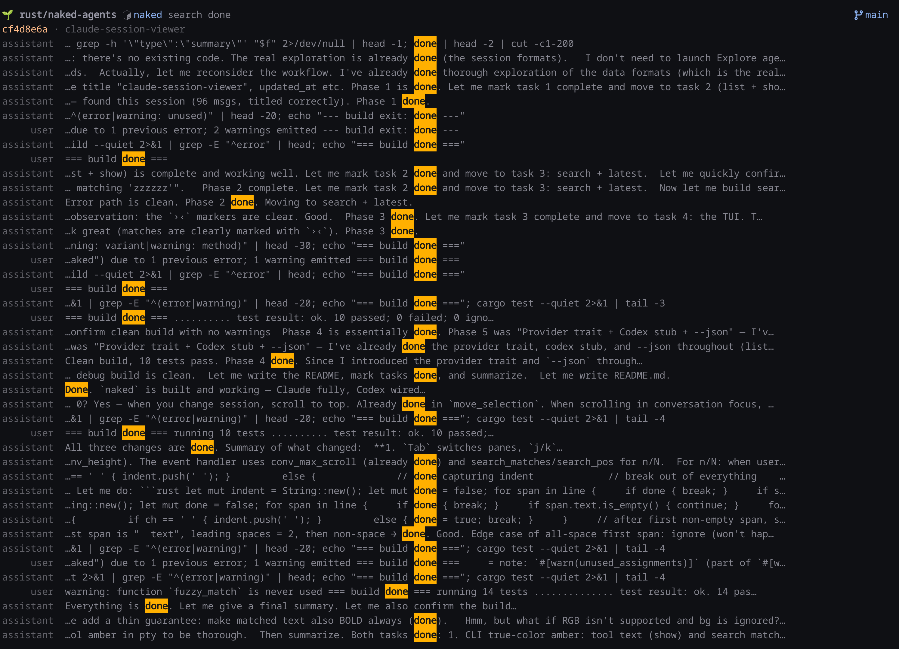
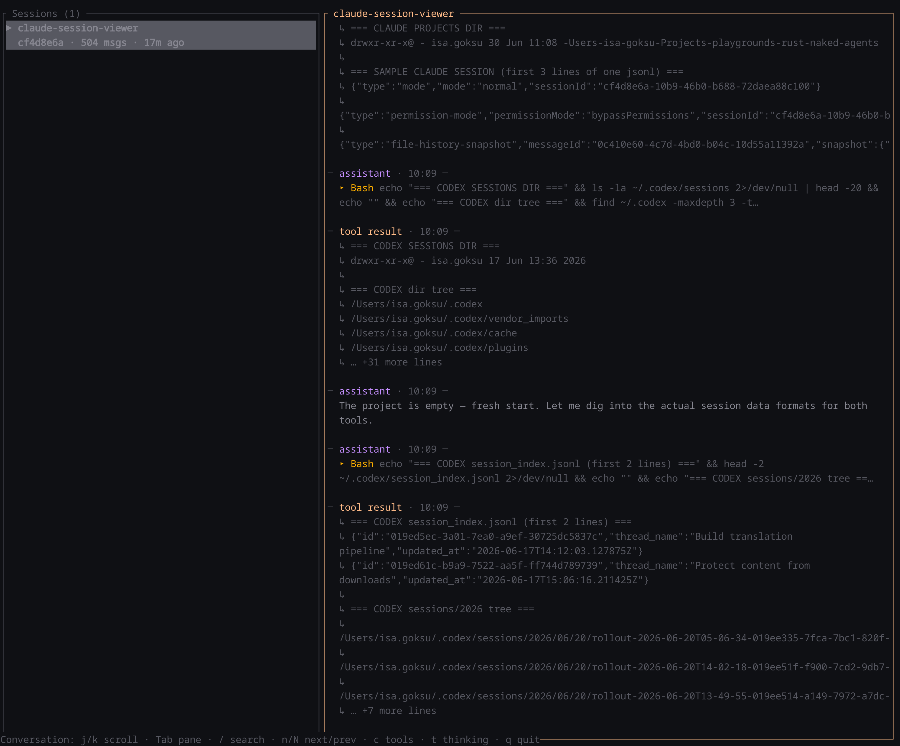

# naked

A viewer, browser, and full-text searcher for **Claude Code** and **Codex** sessions.

Sessions live as JSONL on disk (`~/.claude/projects/...`, `~/.codex/sessions/...`).
`naked` turns them into a navigable, searchable transcript.

> **Status:** Claude is fully supported. Codex is wired in as a provider stub —
> filling in `src/source/codex.rs` is all that's needed to add it (the CLI, TUI,
> and search layers are provider-agnostic).

## Install / run

```sh
cargo run --release -- <command>   # or: cargo install --path .
```

## Commands

```sh
naked list                              # table of all sessions (newest first)
naked list --provider claude --limit 20
naked show <id>                         # full transcript (id prefix or title substring ok)
naked show <id> --no-tools --no-thinking
naked show <id> --raw                   # plain text, pipe-friendly
naked latest                            # most recently updated session
naked search "tokio runtime"            # full-text search across sessions
naked tui                               # interactive browser
```

All color-generating commands take `--color always|auto|never` (default `auto`):
use `always` to keep color when piping through `head`/`tail`/`grep`.
`list`, `show`, and `search` all take `--json` to emit the unified model.

## Screenshots





### TUI keybindings

`j`/`k` always act on the **focused pane** (cyan border). `Tab` switches panes.

```
Tab                switch pane (list ↔ conversation)
j / k  or  ↑ / ↓   list: move selection   ·   conversation: scroll
g / G              list: first/last       ·   conversation: top/bottom
Enter              open session (and focus the conversation)
PgUp / PgDn        scroll conversation by half a page
/                  search within the conversation — matches highlight (amber)
                   live as you type; Enter jumps, n / N go to next / previous
c                  toggle tool calls      ·   t   toggle thinking
Esc                clear search (or quit if none active)
q                  quit
```

## Architecture

```
src/
  model.rs     provider-agnostic types (Provider, Role, Block, Message, Session…)
  source/
    mod.rs     SessionSource trait + registry() — add a provider here
    claude.rs  Claude JSONL loader (tolerant: skips unknown/line types)
    codex.rs   stub
  format.rs    single renderer → RenderLine; ANSI (CLI) + ratatui (TUI) sinks
  search.rs    full-text scan with contextual snippets
  cli.rs       clap subcommands
  tui.rs       ratatui + crossterm two-pane browser
```

One renderer (`format.rs`) feeds both the CLI and the TUI, so a transcript looks
the same in both. Parsing is deliberately loose — unknown JSONL line/block types
are skipped, never fatal, so the on-disk format can drift without breaking reads.

## License

Licensed under the [MIT License](LICENSE).
